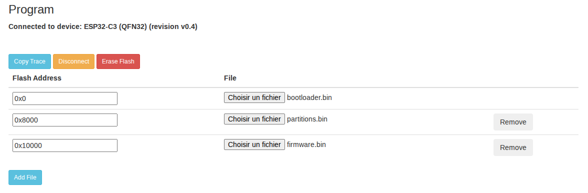

# DeadPingNotify - Système de surveillance de coupures de courant

DeadPingNotify est une solution simple pour surveiller les coupures de courant à distance en utilisant des microcontrôleurs ESP32 et Google Sheets comme serveur de monitoring.

## Principe de fonctionnement

Le système repose sur deux composants principaux :

1.  **L'ESP32** : Placé à l'endroit à surveiller, il envoie régulièrement un "ping" (une requête HTTP POST) vers une Web App Google Apps Script.
2.  **Google Sheets & Apps Script** :
    *   **Le tableur (Sheets)** sert de base de données pour stocker le dernier moment où chaque ESP32 a été vu.
    *   **L'Apps Script** reçoit les pings, met à jour le tableur, et vérifie régulièrement si des appareils n'ont pas donné de nouvelles depuis trop longtemps.
    *   Si un délai (timeout) est dépassé, une notification par email est envoyée aux destinataires configurés. Un email est également envoyé lors du retour en ligne de l'appareil, et la connexion d'un nouvel appareil.

---

## Installation

### 1. Flashage de l'ESP32

Vous n'avez pas besoin d'installer d'environnement de développement pour utiliser le système.

*   Téléchargez les binaires `bootloader_esp32xx.bin`, `partitions_esp32xx.bin`, `firmware_esp32xx.bin` depuis la section [Releases](https://github.com/NoePeterlongo/DeadPingNotify/releases) de ce projet.
*   Accédez à l'[ESP Tool en ligne](https://espressif.github.io/esptool-js/) (La compatibilité avec Firefox n'est pas encore garantie).
*   Connectez votre ESP32 à votre ordinateur et flashez-le :
    - Dans la section `Program`, cliquez sur `Connect`, puis sélectionner le bon périphérique.
    - Remplissez les champs : 
    
    - Cliquez sur `Program`. La progression s'affiche en dessous.
    - Débranchez-rebranchez l'esp32 (ou appuyez sur le bouton `RST` de la carte).
    - En cas de problème essayez de recommencer, en cliquant sur `Erase Flash` avant `Program`.

### 2. Configuration Wifi et Accès à l'interface de l'ESP32

*   Une fois flashé et démarré, l'ESP32 créera un point d'accès Wifi (ESP32_****).
*   Connectez-vous à ce réseau avec votre smartphone ou ordinateur.
*   Une page de configuration devrait s'ouvrir automatiquement. Sinon, accédez à l'adresse `192.168.4.1`.
*   Configurez votre Wifi domestique.
*   Une fois connecté à votre Wifi, l'ESP32 obtiendra une adresse IP locale. Vous pouvez la trouver via le port série (115200 bauds) ou en scannant votre réseau.
    *  Vous pouvez utiliser la section `Console` de [ESP Tool en ligne](https://espressif.github.io/esptool-js/) pour vous connecter via le port série, puis cliquer sur le bouton `RST` de la carte.
*   Accédez à l'adresse IP de l'ESP32 dans votre navigateur (par exemple `http://192.168.1.42` (pas `https`)) pour accéder au formulaire de configuration. Il faut pour cela être connecté sur le même réseau wifi.

### 3. Configuration de Google Sheets & Apps Script

1.  Créez une nouvelle **Feuille de calcul Google (Google Sheets)**.
2.  Allez dans **Extensions > Apps Script**.
3.  Copiez le contenu du fichier `apps_scripts/Code.gs` de ce dépôt dans l'éditeur de script.
4.  **Déploiement** :
    *   Cliquez sur **Déployer > Nouveau déploiement**.
    *   Type : **Application Web**.
    *   Exécuter en tant que : **Moi**.
    *   Qui a accès : **Tout le monde** (c'est nécessaire pour que l'ESP32 puisse envoyer des données sans authentification Google complexe).
    *   Copiez l'**URL de l'application Web** générée.
5.  **Configuration du Tableur** :
    Le tableur doit être structuré de la manière suivante :
    *   **Ligne 1** : Cellule A1: `emails:`, puis B1, C1... les adresses emails des destinataires.
    *   **Ligne 2** : Cellule A2: `api_key:`, puis B2: votre clé API.
    *   **Ligne 3** : Cellule A3: `timeout_s:`, puis B3: le délai avant alerte en secondes.
    *   **Ligne 4** : Les entêtes des colonnes de données (`id`, `last ping`, `status`).

    **Exemple de contenu :**

    | | A | B | C |
    |---|---|---|---|
    | **1** | **emails:** | mail@email.com | |
    | **2** | **api_key:** | MonSuperCodeSecret123! | |
    | **3** | **timeout_s:** | 60 | |
    | **4** | **id** | **last ping** | **notification status** |
6.  **Mise en place du Trigger** :
    *   Dans l'éditeur Apps Script, cliquez sur l'icône **Déclencheurs** (réveil) à gauche.
    *   Ajoutez un déclencheur pour la fonction `checkDevicePings`.
    *   Source : **S'appuyant sur le temps**.
    *   Type : **Minuteur par minute**.
    *   Intervalle : **Toutes les minutes**.

### 4. Configuration finale de l'ESP32

Retournez sur l'interface web de votre ESP32 (son adresse IP locale) et remplissez les champs :

*   **Server** : Collez l'URL de la Web App Google Apps Script obtenue à l'étape précédente.
*   **ID** : Donnez un nom unique à votre appareil (ex: `Salon`, `Garage`).
*   **API Key** : Doit correspondre exactement à la clé API saisie dans la cellule B2 du tableur.
*   **Interval (seconds)** : Fréquence d'envoi des pings (ex: `60`). Doit être inférieur au timeout configuré dans Google Sheets.

---

## Mise à jour de l'Apps Script

Si vous modifiez le code dans Apps Script, vous devez redéployer pour que les changements soient effectifs :
1.  Cliquez sur **Déployer > Gérer les déploiements**.
2.  Sélectionnez le déploiement actif.
3.  Cliquez sur l'icône **Crayon (Modifier)**.
4.  Dans le champ **Version**, sélectionnez **Nouvelle version**.
5.  Cliquez sur **Déployer**.

---

## Clarification des réglages de temps

Pour que le système fonctionne de manière fiable sans fausses alertes, il est important de comprendre la relation entre ces trois paramètres :

1.  **Interval (ESP32)** : C'est la fréquence à laquelle l'ESP32 envoie un signe de vie. Par exemple, toutes les **60 secondes**.
2.  **Fréquence du Déclencheur (Google Apps Script)** : C'est la fréquence à laquelle le serveur vérifie l'état des appareils. Il est recommandé de le régler sur **toutes les minutes**.
3.  **timeout_s (Google Sheets)** : C'est la durée d'absence autorisée avant de considérer qu'il y a une coupure.

**Règle d'or** : Le `timeout_s` doit TOUJOURS être supérieur à l'Intervalle de l'ESP32.
*   *Réglage recommandé* : `timeout_s` = `Interval` x 2 + 30 secondes.
*   *Exemple* : Si votre ESP32 envoie un ping toutes les **60s**, réglez le timeout à **150s**. Cela permet de tolérer un ping perdu ou un léger retard réseau sans déclencher d'alerte inutile.

---

## Détail du fonctionnement interne

### ESP32
L'ESP32 utilise `WiFiManager` pour la configuration simplifiée du Wifi. La configuration (URL, ID, Clé API) est stockée de manière persistante dans le système de fichiers `LittleFS`. Les pings sont envoyés via des requêtes POST sécurisées (en mode `Insecure` pour simplifier la gestion des certificats racine sur l'ESP32).

### Google Apps Script
*   `doPost(e)` : Reçoit le JSON de l'ESP32, vérifie la clé API, et met à jour la ligne correspondante à l'ID de l'appareil avec la date actuelle.
*   `checkDevicePings()` : Parcourt la liste des appareils. Si `Temps_Actuel - Dernier_Ping > Timeout`, et qu'aucune notification n'a été envoyée, il envoie un email et marque l'appareil comme "Notification Envoyée".

---

## Compilation (pour les développeurs)

Si vous souhaitez modifier le code source de l'ESP32 :
1.  Installez [VS Code](https://code.visualstudio.com/) et l'extension [PlatformIO](https://platformio.org/).
2.  Clonez ce dépôt.
3.  Ouvrez le dossier avec VS Code.
4.  PlatformIO installera automatiquement les dépendances (ArduinoJson, ESPAsyncWebServer, WiFiManager, etc.).
5.  Utilisez le bouton **Build** (tick) ou **Upload** (flèche) de PlatformIO.

---

## Autres éléments utiles
*   Assurez-vous que l'ESP32 est branché sur une prise secteur que vous souhaitez surveiller.
*   En cas de coupure de courant, votre routeur Wifi s'éteindra probablement aussi, empêchant l'ESP32 d'envoyer un dernier message. C'est précisément l'**absence de ping** reçue par Google Sheets qui déclenchera l'alerte.
